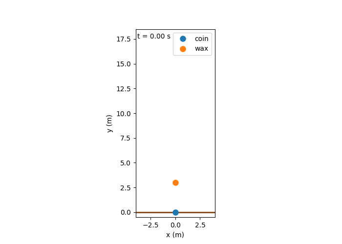
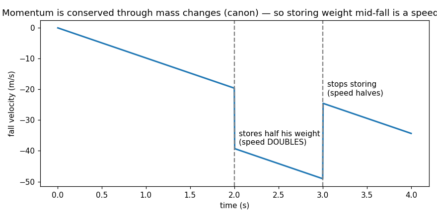
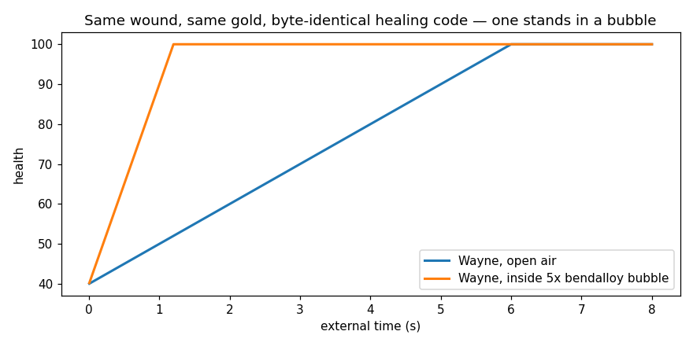
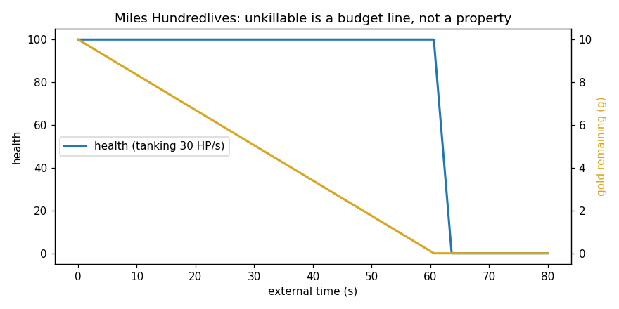
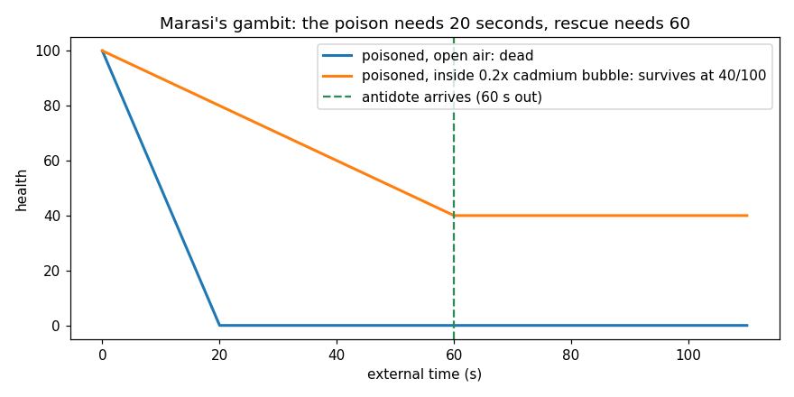
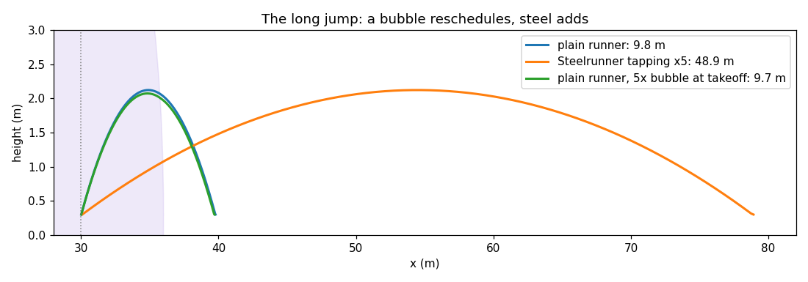

# mistfight

A physics laboratory for Brandon Sanderson's Metallic Arts — allomancy and
feruchemy implemented honestly in a deterministic 2D simulation, then tested
against the books.

(Right now it's more *mistsim* than mistfight — but the name stays, because
Brandon clearly invented these powers with action in mind, and a game is the
long arc.)

## The founding rule: emergence or it isn't a sim

No character outcome is ever special-cased. Each power is implemented as a
small, honest physics component, and the famous moves from the books either
**emerge** from their interaction or the model is wrong. Every modeling choice
that isn't canon is stated out loud in the module docstrings and notebooks.

That rule has paid out repeatedly:

| Book behavior | Lines of code that know about it |
| --- | --- |
| Coinshots launch off grounded coins, not midair ones | 0 — Newton's third law + ground contact |
| Wax flies higher while storing weight | 0 — F = ma with feruchemical mass |
| Wayne heals fast inside his speed bubbles | 0 — normal-rate healing on a local clock |
| Bullets exit bubbles at their original speed | 0 — velocity state never changed |
| Miles is unkillable until his gold runs out | 0 — compounding is just a 10× ledger |
| Steelrunner speed is real velocity; bubble speed isn't | 0 — F-steel dials the legs, never the clock |
| Steep pushes anchor coins; shallow ones skitter them (critical angle 59°) | 0 — Coulomb friction; the push manufactures its own grip |

## Gallery (every image is real sim output)

**The coin-drop launch.** Wax pushes a coin midair (nothing happens — it's
20,000× lighter), it slams into the ground 4 ms later, and the *identical*
force pair launches 80 kg of lawman to 16 m. The engine has no concept of an
"anchor":



**Storing weight mid-fall makes you faster.** Iron feruchemy changes mass,
and momentum is conserved through mass changes (Word of Brandon) — so a
panicking Skimmer who dumps weight mid-fall has doubled his problem:



**Wayne's signature trick, emergent.** Two identical wounded Waynes tap gold
at the same rate; one stands in a 5× bendalloy bubble. The healing code is
byte-for-byte identical between runs:



**Miles Hundredlives, audited.** Gold compounding tanks six times a lethal
poison without a scratch — and then the metal runs out:



**Marasi's gambit.** Cadmium doesn't fight poison (it accelerates everything
in the bubble, including your bloodstream) — it renegotiates deadlines:



**A bubble reschedules; steel adds.** Three long-jumpers with identical legs:
the Steelrunner's 5× is real kinetic state and carries him 49 m; the man
leaping from inside a 5× bendalloy bubble looks just as fast — and lands
within centimeters of the unaided jump, exactly as the theorem demands:



## A theorem the lab tripped over

**Time bubbles change *when*, never *where*.** A projectile's spatial path is
what's left after you eliminate time from the equations of motion — so a
bubble's time factor cancels out of it entirely. Verified to millimeters by
overlaying shots fired with and without bubbles (notebook 07). Consequences:
no trajectory exploits exist, bubbles trade only timing (hang time vs
reaction time), and the books' bullet deflection at bubble boundaries can
*only* come from shear on extended bodies — the nose and tail living at
different time rates. Testing that is the next physics milestone.

## Reading order

The numbered notebooks in [notebooks/](notebooks/) are the real documentation
— reasoning, runs, and plots in one scroll, executed outputs embedded:

1. **A Guy Falls** — engine validation against pencil-and-paper physics
2. **Wax Pushes a Coin** — steelpush, anchoring emerges, the hover ceiling
3. **Wax Stores Weight** — iron feruchemy, momentum jolts, artillery landings
4. **Wayne Heals** — health, gold feruchemy, sickly-while-storing, poison duels
5. **Timeywimey** — bendalloy bubbles and THE emergence test
6. **Miles Hundredlives** — compounding breaks zero-sum; finding his budget
7. **Cadmium** — Marasi's trap, the healing prison, and the when-not-where theorem
8. **The Steelrunner** — speed feruchemy, and why it is measurably not a bubble
9. **Anchors and Traction** — Coulomb friction, fixed anchors, the 59° Coinshot geometry lesson
10. **The Skimmer's Brake** — iron feruchemy as an energy pump; the landing doctrine
11. **The Lurcher** — ironpull, the push/pull grip asymmetry, the grapple

## Running it

```sh
python -m sim.probe_check              # 23 fast assertions — the regression net
python notebooks/execute_notebooks.py  # re-run every notebook, embed outputs
python assets/make_readme_media.py     # regenerate the README images from the sim
```

Requires Python 3.12-ish with `numpy`, `matplotlib`, `nbclient`, `nbformat`,
`pillow`. The engine itself (`sim/`) needs only numpy and matplotlib.

## Lore hygiene

Canon claims are verified against the [Coppermind](https://coppermind.net)
(this repo's research wiki being named after a memory store made of metal is
not lost on anyone) and Words of Brandon before they're modeled. Where canon
is silent, the modeling choice is stated in the code. Where we got it wrong,
the retraction stays visible in the notebooks — the lab keeps its corrections.

## Attribution

Built by Elliott with an **Awakened Metalmind** (Anthropic's, Fable-grade).
Elliott supplies the ideas, the lore corrections, and the standards; the
metalmind writes the code and occasionally retracts its own claims when the
sim catches it narrating.
